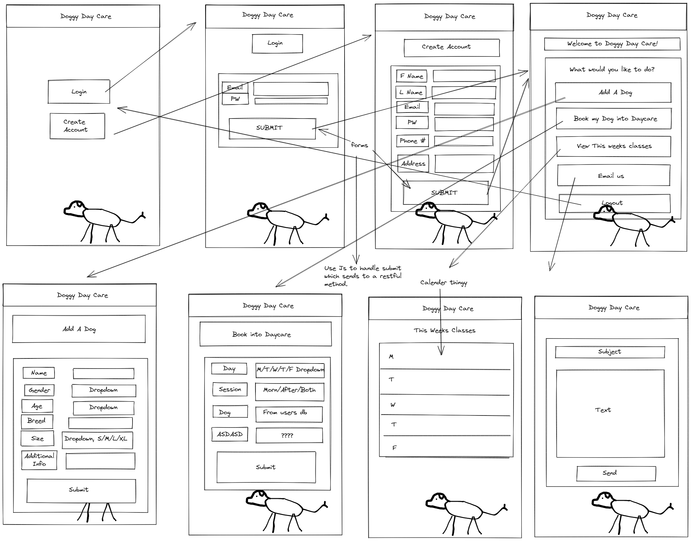
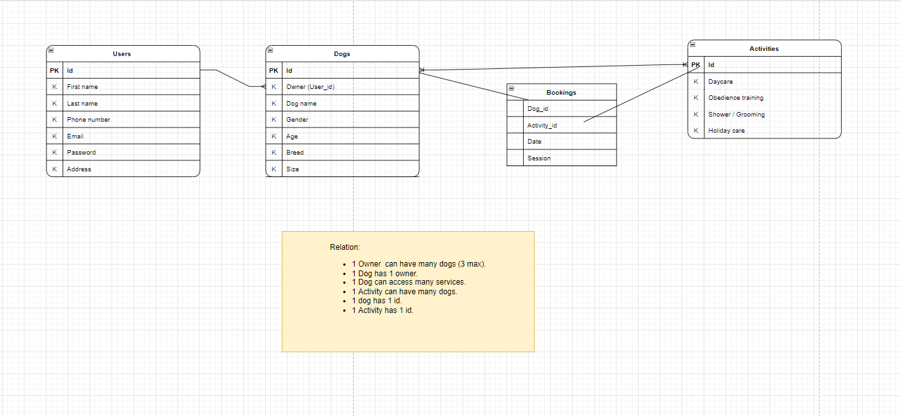
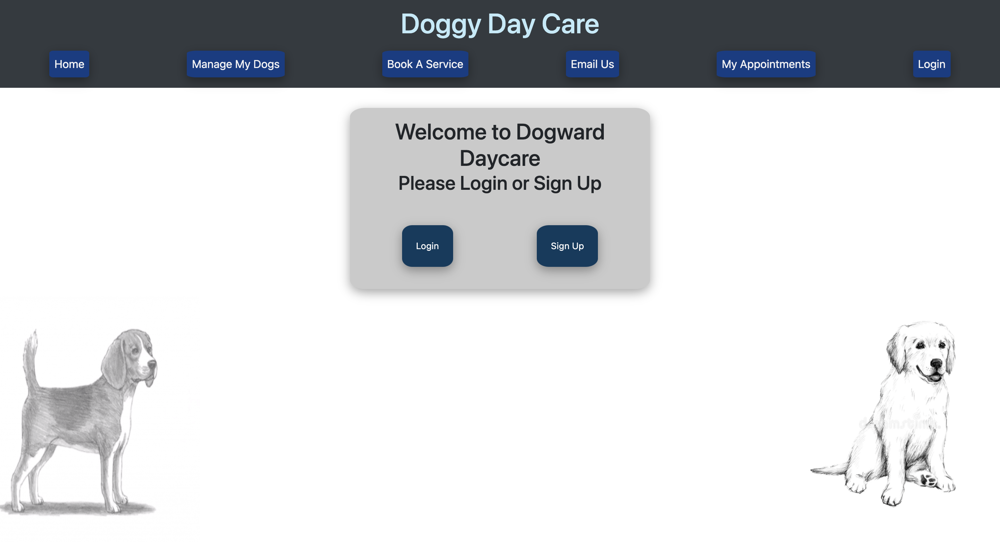
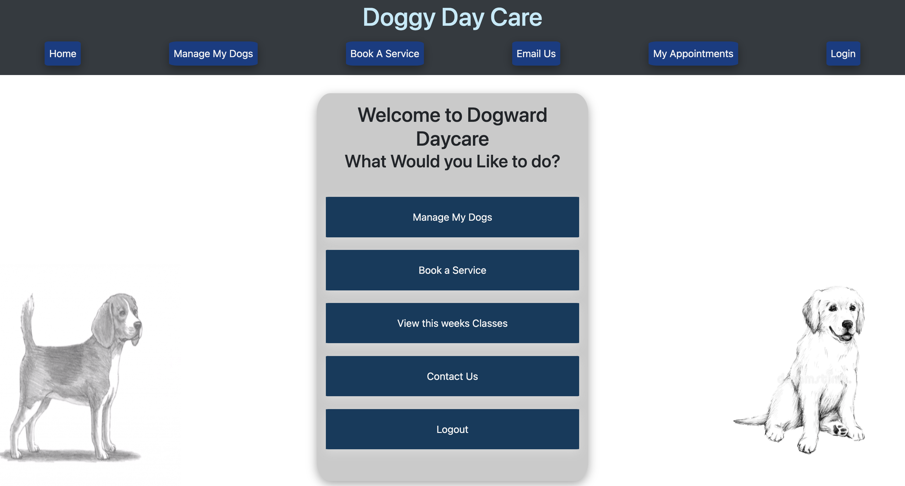
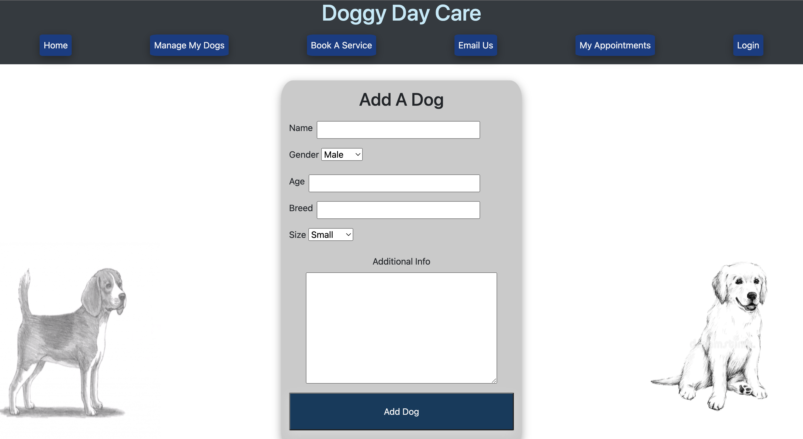
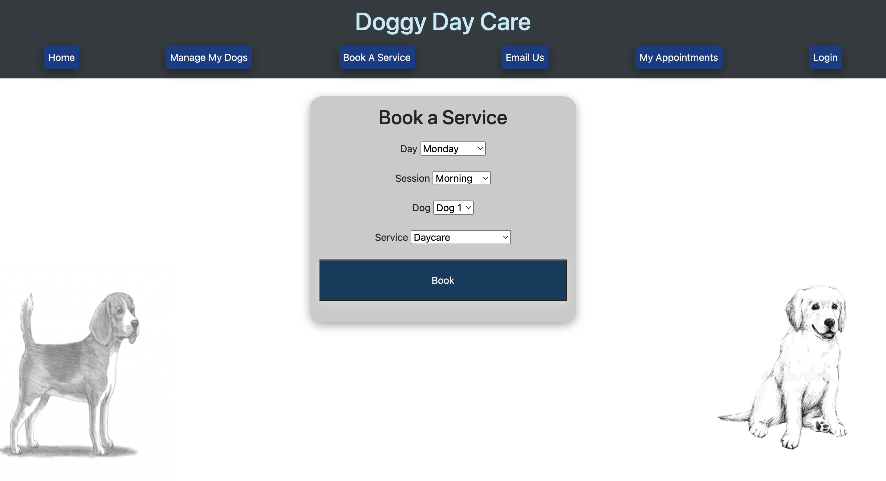

# Doggy-Day-Care
Project that utilises skills to create a RESTful API

# About project

create a real-world full-stack application that you'll be able to showcase to potential employers. The directions and technologies used in creating this project

1. Use of Node.js and Express.js to create a  RESTful API.

2. Use of Handlebars.js as the template engine

3. Use of MySQL and the Sequelize ORM for the database

4. GET and POST routes for retrieving and adding new data

5. Deployed using Heroku (with data).

The project was created with an intention to make a responsive web application that our client could use in their Dog Day Care business.

The project needed to have options for users to login and sign up, they needed to be a method of booking appointments online and also managing their dog profiles and their existing appointments. The client also wanted an easy "contact us" method, where user can write something and immediately gets sent to the admin.

Below are some photos of the planning phase and the the screenshots of how the layout of the app looks like.

# Minimum Viable Product (prototype design - planning phase)

Wireframe/planning stage

ERD - How the IDs would work

# Screensot of work

# Team

George Cheng - https://github.com/opticsl8b
Michael Ariti - https://github.com/MichaelFellas
Mayra Rivas Lara - https://github.com/MayraRivasLara
Kishan Gosrani - https://github.com/kishan254

# Additions

We are always looking for ways to make our code better. If you would like to collaborate and make this app better, please feel free to do so by cloning and pulling the latest files.